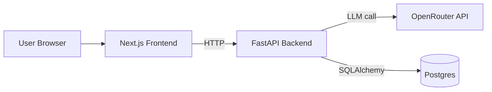

# AI Jobber

AI Jobber is a local-first AI Job Hunt Copilot that tailors CV bullets, drafts cover letters, and generates interview questions from a job description and CV text.

## Problem
Job applications are repetitive and time-consuming. AI Jobber reduces copy/paste effort and gives fast first drafts while keeping the user in control.

## Architecture

## Repo Structure
- `frontend/` Next.js + TypeScript UI
- `backend/` FastAPI service + persistence + LLM integration
- `infra/` docker-compose orchestration

## Local Run
1. Copy env file:
   - `cp .env.example .env`
2. Start stack:
   - `docker compose -f infra/docker-compose.yml --env-file .env up --build`
3. Open app:
   - `http://localhost:3000`

### LLM Provider Notes
- Default is OpenRouter (`OPENROUTER_API_KEY`, `OPENAI_BASE_URL=https://openrouter.ai/api/v1`).
- OpenAI-compatible providers are supported via `OPENAI_API_KEY` + `OPENAI_BASE_URL`.
- Gemini key can be used through an OpenAI-compatible Gemini endpoint by setting:
  - `GEMINI_API_KEY` (or `OPENAI_API_KEY`)
  - `OPENAI_BASE_URL` to your Gemini OpenAI-compatible base URL
  - `OPENAI_MODEL` to the Gemini model ID exposed by that endpoint
- Optional fallback chain:
  - `FALLBACK_MODELS=model-a,model-b,model-c`
  - Backend tries `OPENAI_MODEL` first, then each fallback model if needed.

## API
- `GET /health`
- `POST /generate`
- `GET /applications?limit=5`

`POST /generate` returns:
- `tailored_bullets`
- `cover_letter`
- `interview_questions`
- `relevance_score`
- `jd_coverage`
- `risk_flags`
- `used_model`

## Screenshots
Add screenshots in this section after running locally.

## Roadmap (Phase 2)
- pgvector embeddings + semantic history search
- AWS deployment (ECS/Fargate + RDS + secrets management)
- Better scoring/ranking of generated outputs
