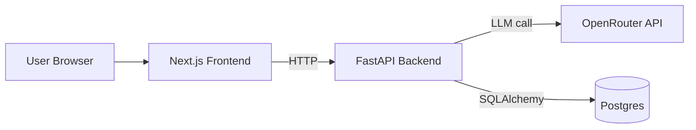

# AI Jobber

AI Jobber is a local-first AI Job Hunt Copilot that tailors CV bullets and drafts cover letters from a job description and CV text.

## Problem
Job applications are repetitive and time-consuming. AI Jobber reduces copy/paste effort and gives fast first drafts while keeping the user in control.

## Architecture

## Repo Structure
- `frontend/` Next.js + TypeScript UI
- `backend/` FastAPI service + persistence + LLM integration
- `infra/` docker-compose orchestration

## Local Run
1. Copy env file:
   - `cp .env.example .env`
2. Start stack:
   - `docker compose -f infra/docker-compose.yml --env-file .env up --build`
3. Open app:
   - `http://localhost:3000`

## API
- `GET /health`
- `POST /generate`
- `GET /applications?limit=5`

## Screenshots
Add screenshots in this section after running locally.

## Roadmap (Phase 2)
- pgvector embeddings + semantic history search
- AWS deployment (ECS/Fargate + RDS + secrets management)
- Better scoring/ranking of generated outputs
